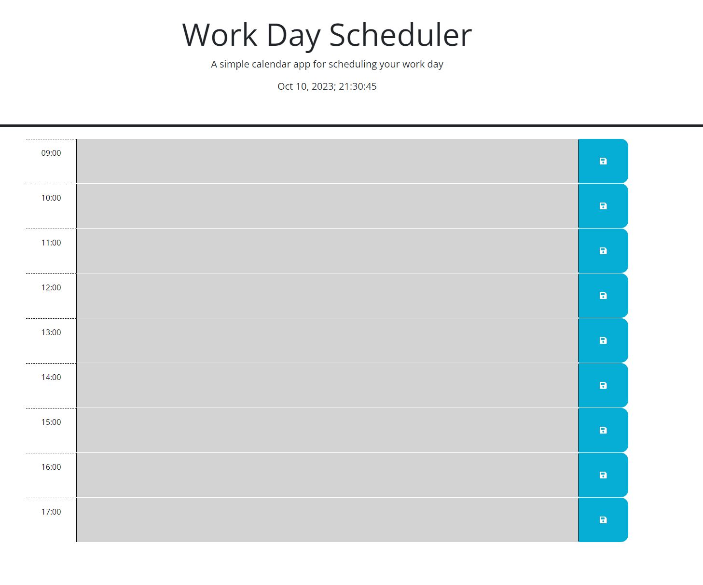
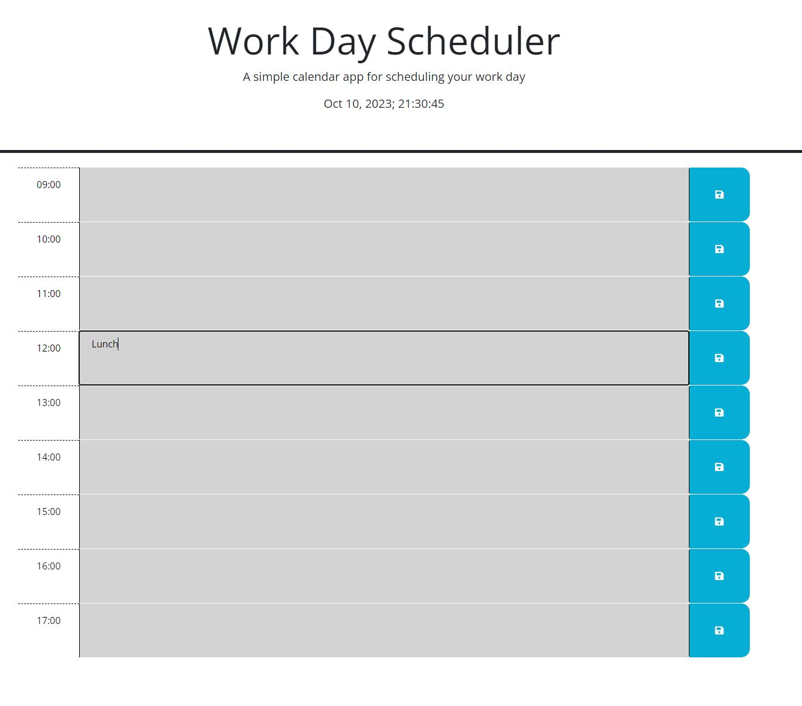
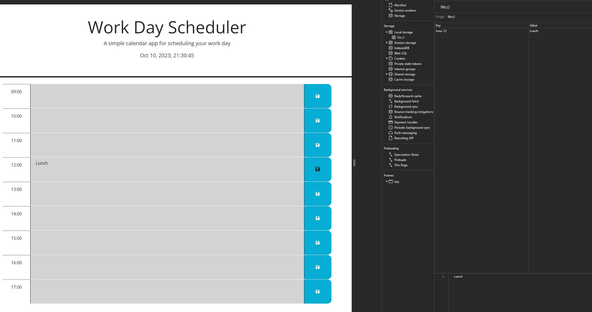
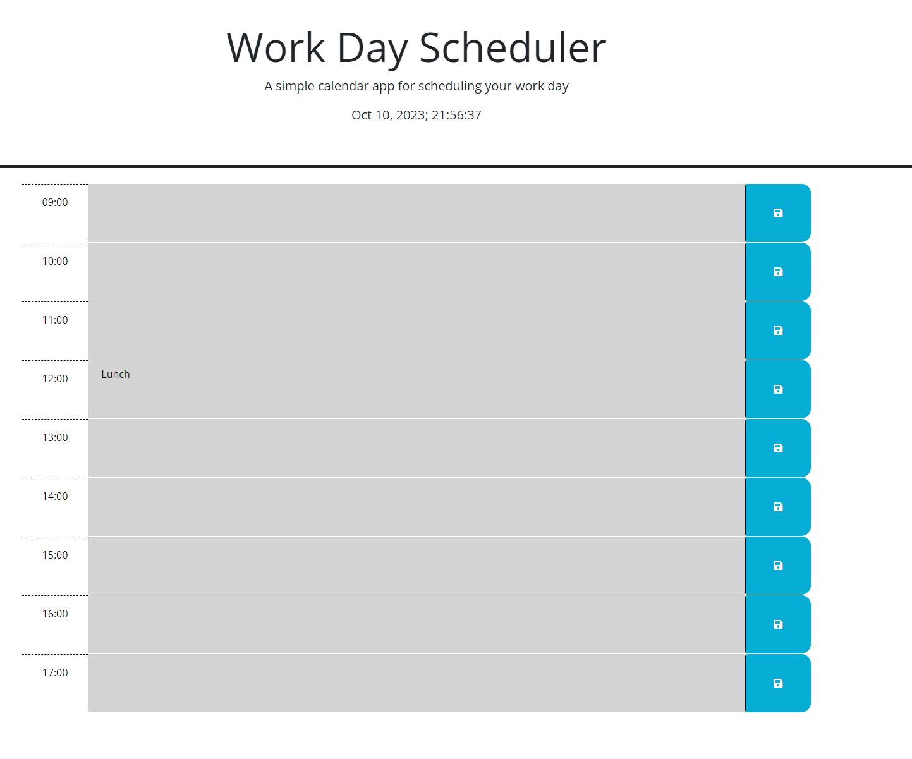

# daily-planner

## NAME
The name of this webpage is Daily Planner.

## DESCRIPTION
This webpage is designed to display a daily 9-5 schedule that allows you to place events in each hour block, and save them to allow for the data to persist on webpage reload. Additionally, each hour block will be dynamically displayed in relation to the current time. If the current time is 11am, then the 9am and 10am hour blocks will be greyed out to display past hour blocks, the 11am hour block will be red to display the current hour, and the 12pm-5pm hour blocks will be green to display future hour blocks. 

## PROGRAMS USED
I used HTML and CSS to create the header and nav contents of this webpage and javascript (specifically Jquery) to create the daily planner content. Git/Github were used as version control and deployed to Github Pages.

## INSTALLATION
This is a website only and does not need installation. it is currently hosted in github and you can access it at Github; https://nfailor.github.io/daily-planner/

## USAGE
This webpage is used to save and review planned events in a daily planner, which is reactive to the current time. See webpage below:

To be able to add an event to any hour block, just click into the box and add the content, then click the save button to the right of the corresponding hour block, as seen below:

Upon saving the information onto the webpage, you can open the localstorage to see that the information has saved, as seen below:

Finally, upon refresh of the page, the user can see the content still displayed where they entered it, as seen below:

## SUPPORT AND CONTRIBUTION
If you have any questions or concerns, please reach out to nfailor@gmail.com

## AUTHORS AND ACKNOWLEDGEMENT
I am Nick Failor, the author of this project.

## LICENSE
N/A